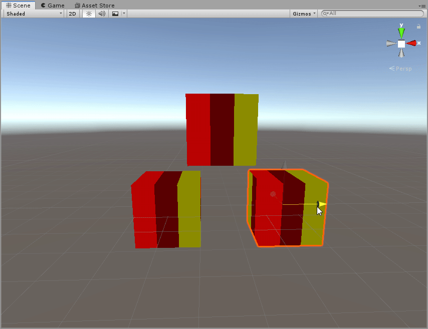
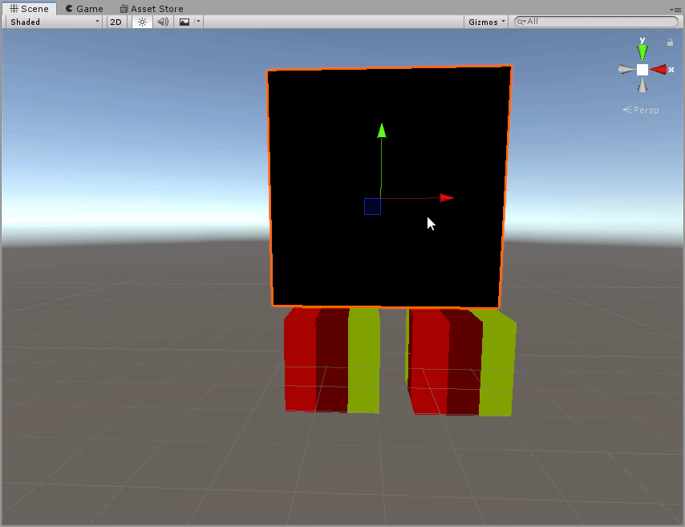
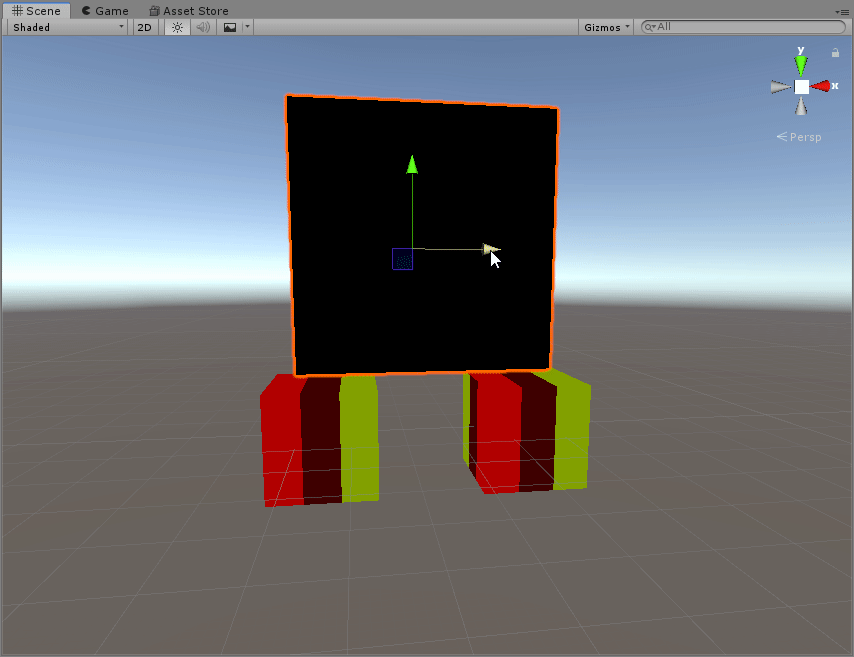
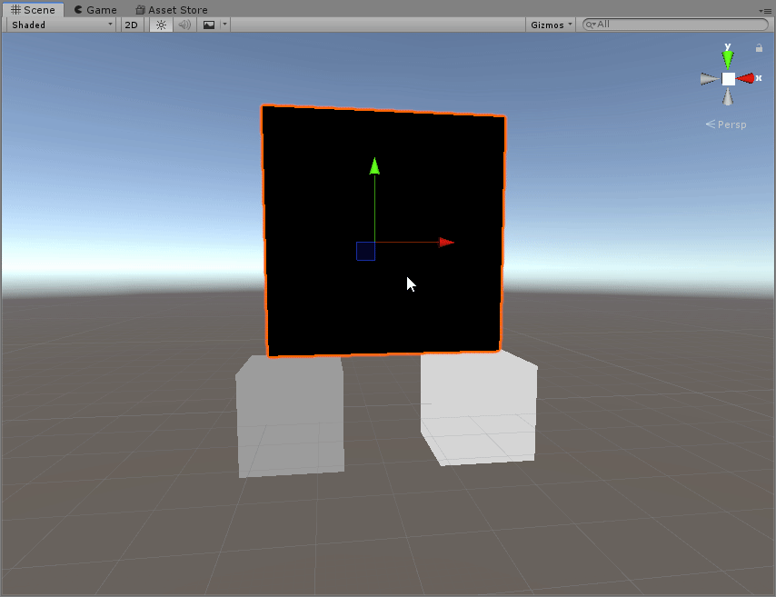

# GPU instancing tricks

GPU instancing is a feature primarily used for improving performance of rendering many of the same mesh. However, we it can be abused as a method of getting the positions of arbitrary objects in a shader, as an alternative to point lights (see point light abuse section in tips-and-tricks.md).

## How to setup
At the top the shader, add a pragma for instancing:
```glsl
#pragma multi_compile_instancing
```

Next, use macros to declare instance ID's in the input structs to your vertex and fragment shader:
```glsl
struct appdata
{
    ...
    UNITY_VERTEX_INPUT_INSTANCE_ID // add this
};

struct v2f
{
    ...
    UNITY_VERTEX_INPUT_INSTANCE_ID // add this
};
```

In your vertex shader, make sure to transfer the instance ID using the relevant macros:
```glsl
v2f vert(appdata v)
{
    v2f o;
    UNITY_SETUP_INSTANCE_ID(v);
    UNITY_TRANSFER_INSTANCE_ID(v, o);
    ...
}
```
That's it, you are now ready to sample the positions of different renderers using the shader.

## Sampling renderer positions
First, setup your scene:
- Make a renderer (a cube for example) for each object you want to track the position of
- Make **one** material for the renderers. All renderers should be using the same material
- Make sure the 'GPU Instancing' checkbox is ticked on the material
- Apply the material to each of the renderers

Now, as an example, let's make a shader that gets the position of 3 cubes and shows these positions as colors. We are going to be abusing some macros that only work when instancing is enabled, so you should put your code within such a guard:
```glsl
#if defined(UNITY_INSTANCING_ENABLED)
// ... code goes here
#else
return 0;
#endif
```

Inside of this guard, declare a value of your input struct to the fragment function:
```glsl
v2f dummy;
```

Next, we'll use the `UNITY_SETUP_INSTANCE_ID(...)` macro to get the positions of each of the renderers. Calling this macro will change the value of `unity_ObjectToWorld` to correspond to the matrix for the renderer with the given instance ID. We can then extract position in world space from the last column of this:
```glsl
float3 cube_positions[3];
for (int idx = 0; idx < 3; idx++)
{
    // make unity_ObjectToWorld point to renderer given by idx
    dummy.instanceID = idx; 
    UNITY_SETUP_INSTANCE_ID(dummy);

    // get world space position of renderer and store it
    float3 wpos = float3(unity_ObjectToWorld[0][3], unity_ObjectToWorld[1][3], unity_ObjectToWorld[2][3]);
    cube_positions[idx] = wpos;
}
```

After the loop, make sure to restore the current renderers matrix:
```glsl
UNITY_SETUP_INSTANCE_ID(i);
```

Lastly, we can use these retrieved positions to color the cubes:
```glsl
return float4(cube_positions[floor(i.uv.x * 3)], 1);
```

Putting it all together, we get something like this:
```glsl
float4 frag (v2f i) : SV_Target
{
    #if defined(UNITY_INSTANCING_ENABLED)

    v2f dummy;
    float3 cube_positions[3];
    for (int idx = 0; idx < 3; idx++) // get positions of 3 first renderers
    {
        dummy.instanceID = idx; 
        UNITY_SETUP_INSTANCE_ID(dummy);

        float3 wpos = float3(unity_ObjectToWorld[0][3], unity_ObjectToWorld[1][3], unity_ObjectToWorld[2][3]);
        cube_positions[idx] = wpos;
    }

    UNITY_SETUP_INSTANCE_ID(i);
    
    return float4(cube_positions[floor(i.uv.x * 3)], 1);

    #else
    return 0;
    #endif
}
```
And the result looks like so:



Notice how changing any of the 3 cubes affects the shading of all 3.

## Distinguishing renderers
You may notice an issue with the previous example. The instance ID of each renderer seems to be changing depending their position, causing the order of the color strips to change seemingly at random.

A common use case of this technique is to have 1 of the renderers do all the rendering, while the other renderers sole purpose is to track position. To properly implement this, we need to be able to pin or at least keep track of which renderer is which.

#### Solution one - Custom properties
One solution is to set some sort of property on each renderer to identify, such as a custom scale. For example, lets set the scale for one of the renderers in the previous example to 0.4, and look for that specific number in the shader. Above the previous return statement I add:
```glsl
if (unity_ObjectToWorld[0][0].x == 0.4) return 0;
```
Now the cube with scale of 0.4 is rendered differently from the other 2, even though all 3 positions are still tracked:



This solution isn't very robust though, so a better solution is described in the following section.

#### Solution two - Set Renderer.sortingOrder
Resident genius lox9973 found that one can set the sortingOrder property of each renderer to uniquely identify each renderer with an instance ID that doesn't change. This serialized property is not exposed in the inspector, but can be set via an editor script. Let's write a script to do this:

```csharp
using UnityEngine;

[ExecuteInEditMode]
public class SetSortingOrder : MonoBehaviour
{
    public int sortingOrder;
    void OnEnable()
    {
        GetComponent<Renderer>().sortingOrder = sortingOrder;
    }
}
```

Add the script to each of the renderers, and make sure to set a different number for each in the inspector. I used 0, 1, 2. Then, enable the script on each of the renderers. Let's test it out:



Notice how you can now rely on the instance IDs being stable!

To further illustrate, let's try shading each renderer based on its instance ID:
```glsl
float4 frag (v2f i) : SV_Target
{
    #if defined(UNITY_INSTANCING_ENABLED)
    return i.instanceID / 3.0;
    #else
    return 0;
    #endif
}
```

And see how every renderer is getting a different, stable shade of gray:


