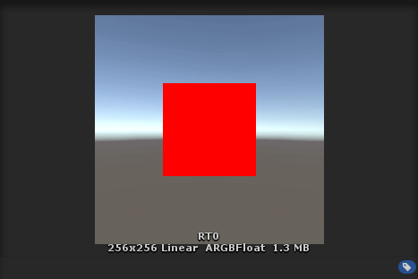
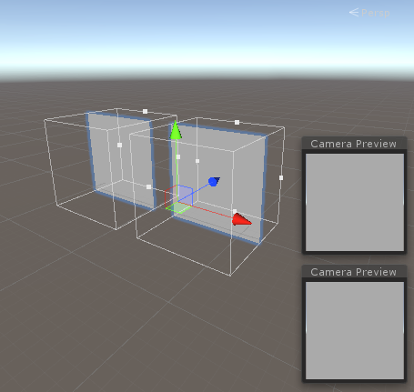
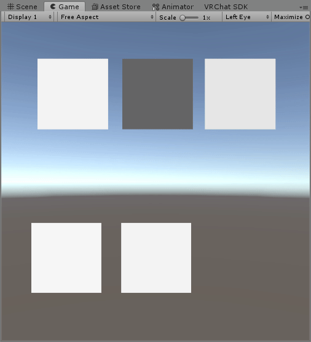

# Multiple Render Targets
Multiple Render Targets (MRT) is a technique that can be used to render to up to 8 RenderTextures in a single pass of a single shader. This is great for cleanliness and performance, but can only be used in worlds.

## How to setup
MRT in its most basic form is fairly straight forward to setup:
1. Create a camera.
2. Create as many RenderTextures as you would like to render to.
3. Use `Camera.SetTargetBuffers` to point the camera to the RenderTextures.
4. Use the `SV_Target0` - `SV_Target7` semantics in a shader to write to each of these RenderTextures.

Let's explore those last 2 steps more in depth. To setup MRT, we need to make a script that calls `Camera.SetTargetBuffers`. Here is an example:
```csharp
using UnityEngine;

public class SetMRT : MonoBehaviour
{
    public RenderTexture RT0, RT1, RT2, RT3;

    void Start()
    {
        GetComponent<Camera>().SetTargetBuffers(
            new RenderBuffer[] { RT0.colorBuffer, RT1.colorBuffer, RT2.colorBuffer, RT3.colorBuffer },
            RT0.depthBuffer);
    }
}
```
This script, when attached to a Camera, will allow you to render to the 4 RenderTextures assigned to `RT0`, `RT1`, `RT2` and `RT3`. This can easily be extended to support up to 8 RenderTextures. Keep in mind you can only (and must) render to _one_ depth buffer, which is the second argument of `SetTargetBuffers`.

Now, let's write a shader that makes use of MRT. It is very simple to do, you modify your fragment function to output a struct where each field has a `SV_TargetN` semantic where `N` is an integer from 0-7. Then, you simple write to each of these fields to write to each of the render targets:
```glsl
#pragma fragment frag
...

struct frag_out
{
    float4 color0 : SV_Target0;
    float4 color1 : SV_Target1;
    float4 color2 : SV_Target2;
    float4 color3 : SV_Target3;
};

frag_out frag (v2f i)
{
    frag_out res;
    res.color0 = float4(1, 0, 0, 1);
    res.color1 = float4(0, 1, 0, 1);
    res.color2 = float4(0, 0, 1, 1);
    res.color3 = float4(1, 0, 1, 1);
    return res;
}
```

With this setup, put the shader on a some piece of geometry, I'll use a cube, and enter playmode to test it out. Make sure the camera can see the geometry. Now, notice how each RenderTexture will contain different results:



## MRT camera loops
MRT is especially useful for implementing large camera loops with a single pass. This is quite an advanced topic, so as a prerequisite, you should understand camera loops, which are explained [here](camera-loops.md).

The idea is to use MRT to implement the equivalent of up to 8 consecutive camera loops in a single pass. Note that camera loops with this setup must be double-buffered. To keep the examples fairly simple, I'll implement the equivalent of 3 consecutive camera loops using MRT, though you can do up 8, as mentioned earlier.

First, we set up our double-buffered camera loop as usual. 2 ortographic cameras looking at a quads. There is no need to assign anything to their 'Target Texture' field.



Next, we create 6 RenderTextures with the same sizes (2 for each of 3 camera loops we are simulating, since each needs double-buffering). I'll use the naming scheme `RT0`-`RT2` for the main textures, and `RT0_DB`-`RT2_DB` for the double buffer textures.

Now, we need a script to assign our RenderTextures using `SetTargetBuffers`:
```csharp
using UnityEngine;

public class SetMRT : MonoBehaviour
{
    public Camera LoopCamera;
    public Camera DBCamera;

    public RenderTexture RT0, RT1, RT2, RT0_DB, RT1_DB, RT2_DB;

    void Start()
    {
        LoopCamera.SetTargetBuffers(
            new RenderBuffer[] { RT0.colorBuffer, RT1.colorBuffer, RT2.colorBuffer }, 
            RT0.depthBuffer);
        DBCamera.SetTargetBuffers(
            new RenderBuffer[] { RT0_DB.colorBuffer, RT1_DB.colorBuffer, RT2_DB.colorBuffer }, 
            RT0_DB.depthBuffer);
    }
}
```
I attached this script to a GameObject in my scene and assigned the cameras and RenderTextures accordingly. Now, we need a shader for our camera loops, and one for double buffering. Let's start with the main shader that implements loop logic. 

First, add texture fields for each of the loops:
```
Properties
{
    _RT0("RT0", 2D) = "white"{}
    _RT1("RT1", 2D) = "white"{}
    _RT2("RT2", 2D) = "white"{}
}
SubShader
{
    Pass
    {
        CGPROGRAM
        ...
        sampler2D _RT0;
        sampler2D _RT1;
        sampler2D _RT2;
        ...
        ENDPROGRAM
    }
}
```
Make the fragment function as so:

```glsl
struct fragout
{
    float4 color0 : SV_Target0;
    float4 color1 : SV_Target1;
    float4 color2 : SV_Target2;
};

fragout frag (v2f i)
{
    fragout res;

    res.color0 = frac(tex2D(_RT0, i.uv) + 0.01);
    res.color1 = frac(tex2D(_RT1, i.uv) + 0.03);
    res.color2 = frac(tex2D(_RT2, i.uv) + 0.05);

    return res;
}
```
This will simulate 3 loops that each change color at different speeds. Now, we need the shader for double buffering. This will be set up in the same way, but with a fragment function that just does a simple data copy:
```
struct fragout
{
    float4 color0 : SV_Target0;
    float4 color1 : SV_Target1;
    float4 color2 : SV_Target2;
};

fragout frag (v2f i)
{
    fragout res;
    res.color0 = tex2D(_RT0, i.uv);
    res.color1 = tex2D(_RT1, i.uv);
    res.color2 = tex2D(_RT2, i.uv);
    return res;
}
```
Now, we make materials for the 2 shaders and apply them to our 2 quads. Make sure to criss-cross the texture properties to implement double buffering. IE. feed the output textures of the first camera to other cameras associated quad, and vice-versa.

Now, to make sure we can actually see each of the 3 simulated loops in action, I'll put each of the 3 main RenderTextures on quads. If everything was set up correctly, you should be able to enter playmode and see the loops running in the game view:



Here, the 3 top quads are simply showing the 3 main RenderTextures, and the bottom 2 make up the camera loop, being the main loop quad and double-buffering quad respectively.

I realize some may struggle setting this up. For that reason, I have attached an UnityPackage containing an scene with this example setup in attachments folder. You can grab it [here](attachments/MRTExample.unitypackage).

## A note about Oculus Quest
There is an issue with Oculus Quest where the main render target of the _last_ Camera which you call `SetTargetBuffers` on will have a strange debug menu drawn over it. If you run into this issue, just make another Camera which isn't used for anything, and call `SetTargetBuffers` on it, pointing it to some dummy RenderTexture.
