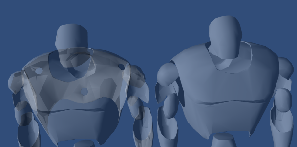

# Tips and tricks
A document for various small tips and tricks I've picked up that don't warrant their own full pages.

### Point light position abuse
Many people use point lights to get the positions of arbitrary objects in shaders. To do this, first set `LightMode` of your shader to a setting that will allow for sampling lights:

```glsl
Tags { "LightMode"="FowardBase" }
...
```

Then, in the shader, you can use this code to get the world space position of the `i`'th point light (`i` can be from 0-3).
```glsl
float3 light_pos = float3(unity_4LightPosX0[i], unity_4LightPosY0[i], unity_4LightPosZ0[i]);
```

To prevent annoyance, most people set the color of their point lights to fully back (0, 0, 0) and use the alpha value to distinguish between point lights. You can get the alpha value of the `i`'th light as so:

```glsl
unity_LightColor[i].a
```

It is important to set the 'Render Mode' of the point light to 'Not Important' to force the light to be a vertex light.

If possible, you should also put the lights 'Culling Mask' to only 'UiMenu' and put whatever you want to interact with the light on that same layer. That way, you don't add passes to everybodies avatar, causing lag. The UiMenu layer, unlike most other layers, is usable even on avatars.

### Worldspace from depth
You can get world space position from the camera depth texture. Here is an example of how to do it. Not sure where this code came from initially, but credits to whoever wrote it. I think it was error.mdl.

```glsl
struct v2f
{
    float2 uv : TEXCOORD0;
    float4 vertex : SV_POSITION;
    float4 grabPos : TEXCOORD1;
    float3 ray : TEXCOORD2;
}

sampler2D _CameraDepthTexture;

v2f vert (appdata v)
{
    v2f o;
    o.vertex = UnityObjectToClipPos(v.vertex);
    o.uv = v.uv;
    o.grabPos = ComputeScreenPos(o.vertex);
    o.ray = mul(UNITY_MATRIX_MV, v.vertex).xyz * float3(-1,-1,1);
    return o;
}

float4 frag (v2f i) : SV_Target
{
    float rawDepth = DecodeFloatRG(tex2Dproj(_CameraDepthTexture, i.grabPos));
    float linearDepth = Linear01Depth(rawDepth);
    i.ray = i.ray * (_ProjectionParams.z / i.ray.z);
    float4 vpos = float4(i.ray * linearDepth, 1);
    float3 wpos = mul(unity_CameraToWorld, vpos).xyz; // world space frament position
    float3 wposx = ddx(wpos);
    float3 wposy = ddy(wpos);
    float3 normal = normalize(cross(wposy,wposx)); // world space fragment normal
    ...
```

### Exporting textures with GrabPass
Textures from named GrabPasses will be available globally in any shader, ie:

```glsl
GrabPass { "_MyGlobalTexture" }
```

Then any shader can access it by just declaring a field:
```glsl
...
sampler2D _MyGlobalTexture;
...
```
[This is what AudioLink uses to make a data texture available to avatars](https://github.com/llealloo/vrc-udon-audio-link/blob/master/AudioLink/Shaders/AudioTextureExport.shader)


### Cheap wireframe abusing MSAA
Courtesy of d4rkpl4y3r.
```glsl
float4 frag (centroid float4 p : SV_POSITION) : SV_Target
{
    return any(frac(p).xy != 0.5);
}
```

### Avoiding draw order issues with transparent shaders
You can add a pass in front of the main pass for a transparent shader which just fills the depth buffer as such:
```glsl
Pass
{
    ZWrite On
    ColorMask 0
}
```
Comparison without and with this pass


### Checking if a texture exists
You can check for existance (if it has been set) of a texture as such:
```glsl
Texture2D _MyTexture;

bool TextureExists()
{
    int width, height;
    _MyTexture.GetDimensions(width, height);
    return width > 16;
}
```
This is especially useful when accessing globally exported GrabPass textures. Keep in mind the texture must be declared as `Texture2D`, not `sampler2D`.

### GLSL modulo operator
Use this instead of HLSL's piece of shit `fmod`. It behaves better on negative numbers.
```glsl
#define glsl_mod(x,y) (((x)-(y)*floor((x)/(y))))
```

### Check if shader is being rendered in mirror
```glsl
bool isInMirror()
{
    return unity_CameraProjection[2][0] != 0.f || unity_CameraProjection[2][1] != 0.f;
}
```